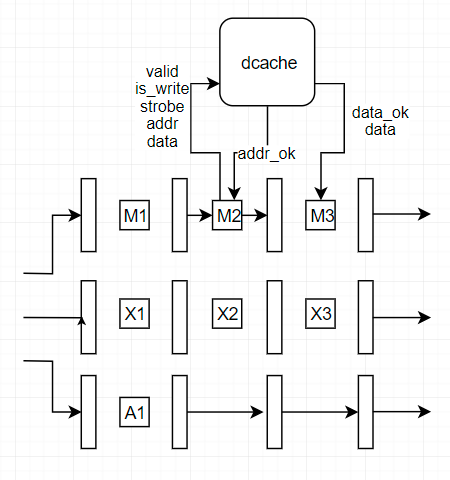

## CPU设计

> 2021/7/22
>
> 此文档是我们小组的处理器实际采用的架构

### CPU架构

与Cache的交互只在取指和访存两个阶段。

1. 取指（1）：将计算好的PC发给ICache
2. 取指（2）：获取ICache中的指令组和其它信息
3. 译码：对指令进行译码，并对分支指令的地址进行计算
4. 发射：往队列尾部插入指令组，在头部根据控制逻辑发射一条或两条指令
5. 数据获取：通过寄存器堆和数据旁路获取数据
6. 执行：用`FU`计算数据
7. 访存（1）：向DCache发送访存请求，延迟取数据
8. 访存（2）：获取DCache中的数据或其它信息，延迟计算
9. 退休：将数据写回到寄存器堆

### 指令数据传输

- ICache传来的指令组要8字节对齐，也就是包含两条指令
- 接收到指令时，需要根据PC值来判断第一条指令是否有效，如果PC值只是4字节对齐而没有8字节对齐（如`bfc00004`），那么此时指令组第一条指令应该判定为无效
- 当分支指令为8字节指令组的前四个字节的话（一条指令4个字节），此时延迟槽正好为后四个字节，不会出现问题，所以该指令组的分支预测正常进行
- 当分支指令为指令组后四个字节的话，需要在下个周期把延迟槽取出来，也就是说该分支指令没有预测的必要，始终是顺序取，等到后面的延迟槽来了才应该真正开始分支预测
- 综上，我们发现，分支预测应该是在延迟槽取来的那个周期进行，而不是分支指令本身！！！
- 但是延迟槽本身没有跳转的地址这样的信息，需要上个周期的分支指令的信息，因此需要在decode阶段放置一个branch buffer来存储上个周期的分支指令的信息，在当前周期处理延迟槽的同时利用这个信息进行分支预测的正确性判断

#### 取指

第一个阶段发送第二个阶段接收的原因：让CPU流水线阶段与ICache的流水线阶段**匹配**，这样可以提高吞吐量，如果在同一个阶段发送并接收的话，CPU流水线就必须暂停，降低了效率。

- 取指分为两个阶段，第一个阶段向ICache发送地址，在第二个阶段接受指令，因为指令传来需要一定时间，所以只对传来的指令进行简单的处理和判断。
- 第一个阶段发送的数据：指令地址PC、地址有效位`valid`
- 以ICache返回的 `addr_ok` 作为是否接受到的标志，若未接收到，需继续发送数据，也就是把当前周期给stall（暂停）住，这个是用流水线控制逻辑实现的。
- 根据当前的PC值，预测下一个PC值，并把是否是跳转指令、是否预测跳转以及跳转的地址传给后续的阶段来判断分支预测的正确性，并更新分支预测模块。
- 第二个阶段传来的数据：指令组中的指令（两条）、指令组的有效位 `data_ok`、指令是否是分支指令`is_branch`（两位、需要ICache预解码）
- 返回的指令组8字节对齐，包含两条指令

#### 译码

- 判断指令的类型，以及源寄存器和目的寄存器的下标，放入到发射队列中

#### 发射

- 两个写端口、两个读端口的FIFO的双发循环队列，用head和tail下标的方式模拟循环队列。
- 存放的数据：指令的地址、指令的各类操作数、是否为访存指令、是否为特权指令、是否为分支指令、是否预测跳转、预测跳转的地址
- 以下不能同时发射两条指令的情况：
- 两条连续的乘除法指令：只有一个乘法器和除法器
- 访存指令：只有一个访存单元，而且DCache只有一个读写端口，没法同时处理两条访存指令
- `CP0`、`TLB`等特权指令
- 两条指令有数据相关：注意0号寄存器的假相关性（0号寄存器一直为零）
- 第二条为分支指令：分支指令和延迟槽必须一起发射，方便后续分支预测的判断。

#### 数据获取

- 用两条指令的源寄存器下标获取源寄存器里的值，同时进行旁路（转发）从而获得所有的操作数
- 寄存器堆有四个读端口、两个写端口

#### 执行和访存阶段

执行和访存阶段在同一个`FU`中完成，其中访存指令需要三个周期，第一个周期计算访存地址，第二个周期发送请求，第三个周期接收请求；乘法指令也需要三个周期；一般的计算指令只需要一个周期。方便起见，这里我们把`FU`中的第一个阶段称为执行阶段，后两个阶段称为访存阶段，而实际上乘法指令的三个阶段都可以算作是执行阶段，普通计算指令只有第一个执行周期，后两个周期目前只是单纯的流水（可以考虑把后两个周期用作**延迟计算**）

#### 执行

- 获得可能的转发数据，生成指令的结果，计算访存地址
- 对于分支指令，这里可以判断是否跳转以及跳转的地址，更新分支预测模块。
- 多周期指令会暂停流水线

#### 访存

- 访存有两个阶段对应于`FU`的第二和第三阶段，与取指的两个阶段类似
- 访存第一阶段会发送的数据：地址有效位、是否为写请求、四位字节写使能、读写的地址、写入的数据
- 访存第一阶段以 `Dache` 返回的 `addr_ok` 作为成功接收的标志
- 同时第一阶段还会处理异常，并进行部分指令的延迟取数据
- 第二阶段接受的信号：有效位 `data_ok` 和数据
- 同时第二阶段还会进行部分指令的延迟计算

#### 退休

- 将数据写回到寄存器堆中

 

### 分支预测架构

> 主流的处理器都是基于两位的饱和计数器来实现的，采用！
>
> 经测试，PHT为2KB时，即PC值中用来寻址PHT的位数为13位，此时分支预测准确率达到了93%，采用！

分支预测可能出现的问题：

| 编号 | 具体表述                   |
| ---- | -------------------------- |
| 1    | 未能正确判断是否是分支指令 |
| 2    | 是否跳转预测错误           |
| 3    | 跳转地址预测错误           |

#### 分支预测

- BIT、PHT、BTB、RAS均用BRAM（话说这玩意到底是个啥，有什么优劣吗，之后要写一下BRAM、LUTRAM之类的部件用途）实现，下述的`PC`索引位仅为示例，具体实现请参数化（~~方便挤牙膏~~）
- BIT：在取指第一阶段根据当前指令的`PC[13:2]`索引是否是分支指令
- PHT：在取指第一阶段根据当前指令的`PC[13:4]`索引是否是跳转，用两位饱和计数器实现
- BTB：在取指第一阶段根据`PC[13:4]`索引跳转的地址
- RAS：在解码阶段根据指令的类型（call：`jal` `bal`、return：`jr ra`）把地址进行压栈或出栈，栈中每一项带有计数器（当压栈时，把栈顶和需要压栈的地址比较，相同就让计数器加一，栈指针不动，出栈时计数器减一，减到零才真正让栈指针往下一格）

#### 正确性判断和更新

- 取指第二阶段根据ICache传来的预解码的是否是分支指令的信息`is_branch`能够判断编号为1的错误
- 解码阶段根据分支指令类型能够判断编号2（部分分支指令一定跳转），根据简单加法器算出的地址能够判断编号3，根据RAS的地址能够判断编号3
- 执行阶段根据得到的结果能够判断完全判断编号2和3
- 在预测错误时需要对上述部件进行更新

 

### 权衡与选择

1. 在哪个阶段读取寄存器的数据，需要额外的一个阶段吗？目前是增加了一个读操作数的周期专门用来读寄存器

2. 取指时分支指令与延迟槽怎么处理？（1）ICache给的指令组中分支和延迟槽绑定，问题：分支和延迟槽不在同一个cache line而且延迟槽cache miss（2）译码阶段若发现没有取到分支指令后的延迟槽，需要把分支的信息放在一个缓存中，等到下一周期取来了延迟槽再进行分支预测及其错误判断（3）折中的一个方法：当分支和延迟槽在同一个cache line时确保他们绑定，否则采取（2）中的方法。

3. 发射阶段若发射指令组第二条分支指令是否可以发射的优劣？

   