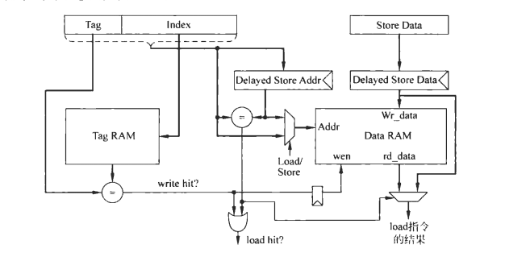
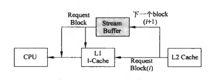
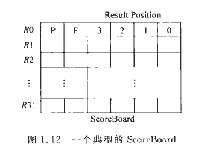
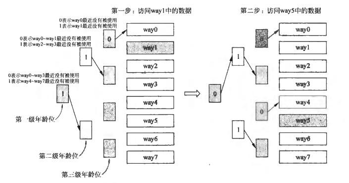
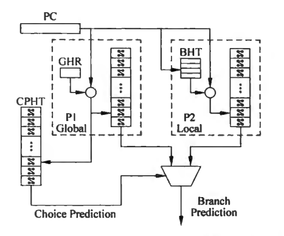

# 龙芯杯资料汇总

> 2021/6/11
>
> 此文档是我们小组从各个地方汇总的资料，为我们实现的架构作参考

 

### 阅读须知

- 此文档是我们小组正在参加的“龙芯杯”比赛的文档，后续会进一步更新
- ==黄色标记部分==表明此处最近在更新
- 实现细节中相对复杂的策略单独列了一个**策略栏**来阐释

 

### 参考资料

1. [超标量处理器设计](materials/超标量处理器.pdf)
2. [19年龙芯杯清华队决赛报告](materials/19年龙芯杯清华队决赛报告.pdf)
3. 复旦大学`FDU1.1`队在第四届“龙芯杯”的[参赛作品](https://github.com/NSCSCC-2020-Fudan/FDU1.1-NSCSCC/)
4. 薛振梁助教的`PPT`：[ICS Final Project Topics](materials\ICS Final Project Topics.pdf)、[RAM on FPGA](materials\ram-on-fpga.pdf)
5. 谭一凡助教写的`labs`：[github网页](https://github.com/Tan-YiFan/ICS-2021Spring-FDU/tree/test_linux)

 

### 常见问题

1. 龙芯杯的top文件需要自己写吗？

> 本学期的top文件实例化了一个龙芯杯的top，可以参考那个。

2. 双发流水线如何进行golden trace的比对？
3. 操作系统进程切换的时候需要我们保存处理器状态吗？
4. `linux`仿真
5. 功能测试需要异常处理吗？

 

### ==器件名称表==

| 缩写   | 全称                         | 意思           | 作用                                   |
| ------ | ---------------------------- | -------------- | -------------------------------------- |
| BIT    | Branch Instruction Table     | 分支指令表     | 用PC预测是否是分支指令                 |
| BB     | Branch Buffer                | 分支暂存器     | 保存当前分支的信息，以等待延迟槽的取来 |
| PHT    | Pattern History Table        | 跳转历史表     | 用以前的跳转记录来判断当前的跳转       |
| BTB    | Branch Target Buffer         | 跳转地址缓存   | 预测跳转的地址                         |
| RAS    | Return Address Stack         | 返回地址栈     | 充当函数调用和返回的硬件栈             |
| ICache | Instruction Cache            | 指令Cache      | 缓存内存到CPU的指令                    |
| DCache | Data Cache                   | 数据Cache      | 缓存内存到CPU的数据                    |
| FU     | functional unit              | 计算单元       | 在执行阶段计算数据                     |
| CPU    | central processing unit      | 中央处理器     | 处理所有的指令                         |
| TLB    | translation lookaside buffer | 转移后备缓冲区 | 缓存虚拟地址和其映射的物理地址         |

 

### 拓展内容

#### 指令集

- 需要实现的指令: [普通部分](materials\指令集.md)、[外设部分](materials\支持操作系统的额外指令.md)
- CLO和CLZ可以共用一套硬件电路，但是就不能同时处理两条指令了

#### ==版本控制==

- github actions自动化测试和部署：自动部署网站和用verilator测试
- git模块处理：git submodule

 

### 部件资料

#### ICache

- 组相连结构、流水线Cache、多端口读取（Mult-banking）、预解码、硬件预取、victim Cache、伪LRU替换策略
- Cache布局图：详见拓展资料（Cache布局图）
- 取值方式：两种方式，目前倾向于用第一种：（1）每次从当前地址开始往后取满一个cacheline，判断逻辑在流水线阶段完成（详见流水线取指逻辑）（2）从当前地址开始往后取两条或三条指令，取决于第二条指令是否是分支指令

- 一个cacheline中有跳转指令：若该指令跳转，则延迟槽之后的指令不应该执行
- cacheline最后一条指令为跳转指令：则必须取完下一条cacheline后再判断分支指令，用流水线控制逻辑处理
- ==cacheline有两条分支指令==
- 其它细节问题：每周期只能访问一个cacheline

#### 分支预测器

- 完整的分支预测：详见拓展资料（完整的分支预测）
- 折中的分支预测：分支预测只针对间接跳转指令（寄存器跳转），其它跳转指令（Call、return或PC直接跳转）在接收到ICache返回的指令后快速进行判断。
- 其它的细节问题：（1）BIT和CPHT数量的差别：与跳转指令的占比有关（2）由于BIT的存在，BTB不设置tag，所以不会缺失（除了一开始的强制缺失）

#### 发射队列

- 双队列交叠（考虑了硬件，其实没必要）、两个读端口和几个写端口
- ==几个写端口==：不管怎么样，都需要用控制逻辑处理分支指令和延迟槽的问题。（1）四个写端口：紧凑但是浪费硬件（~~其实无所谓~~，咱们写代码的），因为后续的双发是瓶颈（2）三个写端口：双队列交叠可能就不方便了，专门处理MIPS指令中的分支指令+延迟槽（19年清华大学队）（3）两个写端口：朴实无华（20年复旦大学队）
- 发射队列怎么判断哪些位置是有效的：==用索引或有效位遍历==
- 队列满：流水线暂停或当前指令重取

#### DCache

- 组相连结构、流水线、==单端口读写==、回写（write back）、写缓存（write buffer）、victim cache、伪LRU替换策略
- 根据 MIPS标准要求，对于不同段的访存，数据缓存行为不同：（1）**kseg3/ksseg** 按 TLB 判断是否经过缓存（2）**kseg1** 不经过缓存（3）**kseg0** 可由 CP0 ConfigK0 寄存器控制，MIPS 标准中这一行为的实现可选（4）**useg** 按 TLB 判断是否经过缓存
- 单端口读写：只有一个访存单元，而且这样可以简化DCache的逻辑，~~当然写Cache的人想多端口也没问题~~​​，这样就需要两个访存单元了
- 采用回写策略（write back）：脏数据被替换的时候才写回
- 写缓存（write buffer）：写回时写到缓存中，等总线空闲的时候再写缓存再写到内存中，不过Cache缺失时，需要先在写缓存里找，判断是否在其中。
- 流水线访问：先写后读冲突，用Delayed Store Addr和Delayed Store Data寄存器解决，类似于转发

#### Store Buffer

- 这个器件跟整体的设计有关，如果能保证执行阶段store正确性的话可以不要
- store指令计算完后放在这里，直到退休（retire）才真正写回DCache，这样的话load指令需要先从Store Buffer里找对应的指令

#### L2 Cache

- 单端口

#### 乘除法器件

- 一个乘法器和一个除法器（考虑到MIPS乘除法指令之间会有移动Hi、Lo的指令，所以不太可能两条乘/除法连在一起），若连续两条乘除法指令，则只发射第一条

#### 访存FU

- 设置一个（连续两条指令为load的可能性很小，没有必要为此增加大量的硬件），若同时有两条load指令，则只发射第一条。

#### 硬件栈

- RAS(Return Address Stack)：带计数器的栈，解决自己调用自己的递归问题。

#### ==数据旁路==

- ScoreBoard

#### ==寄存器文件==

- 四个读端口、两个写端口、Hi和Lo寄存器（特判）

#### ==TLB==

 

### 策略

##### ==组相联结构==

##### 预解码（pre-code）

- 解释：ICache获取内存的数据的时，判断其是否是分支指令，并将结果另外保存在ICache中

##### 流水线Cache

- 解释：像流水线一样处理Cache，降低时钟频率

  

##### victim cache

> 《超标量处理器设计》2.2.4

- 解释：防止被踢出的数据马上被利用，而与之相对的Filter Cache则是防止不会再用的数据一直不被踢出

##### 预取（prefetching）

> 《超标量处理器设计》2.2.5

- 解释：字如其名，提前把额外的数据（当前Cacheline的下几条Cacheline等将来可能会用到的）取好

- ICache效果比DCache要好，DCache可以不使用预取

- 为了防止预取的数据没有用造成“Cache 污染”，可以将预取的指令放到单独的一个缓存（Stream Buffer）中。（Alpha 21064对指令预取使用的方法）

  

##### ScoreBoard

> 《超标量处理器设计》1.3.1

- 解释：用来转发、旁路的表格，保存正在计算的寄存器相关数据在哪里
- P：Pending，表示结果还没有写回到寄存器中
- F：在那个FU中执行，转发时会用到这个信息
- Result Position：记录到达FU流水线的哪个阶段，每个周期右移一位，不同指令的转发条件不同。

##### 伪LRU替换

> 《超标量处理器设计》2.1.3

- 解释：LRU（least recently used），把最晚使用的Cacheline替换出去

##### 交叠实现多端口

- 是一种思想
- 实现：简单的说就是一整块东西拆成多块，然后不同的块可以同时输出，而不用真的在一块上实现多端口。
- 考虑硬件：通常的多端口需要大量资源，交叠可以节省硬件资源（~~不过对于我们来说没啥用~~）
- 可以应用的部件：ICache、发射队列、寄存器文件等等

### 拓展资料

#### 完整的分支预测

> Alpha 21264

在取指阶段预测该指令：

1. 是否是分支指令：用PC的部分索引BIT（branch instruction table）                 （1）是否是CALL指令（jal、bal）：利用BTB（branch target buffer）中存放的额外信息，若是，则把当前PC+8的值（有延迟槽）压入带计数器的RAS（Return Address Stack）（2）是否是Return（jr）：利用BTB中存放额外信息，若是，把RAS中的栈顶元素作为预测的地址

2. 是否会跳转：采用竞争的分支预测（1）GHR（global history register）：记录所有跳转指令的跳转情况（2）BHT（branch history table）：记录局部跳转指令的跳转情况（3）PHTs（pattern history table）：两位的**饱和计数器**表格（4）CPHT（choice PHT）：根据PC和GHR里的值来选择使用哪一个分支预测的结果。

3. 跳转的地址：存放在BTB中

   > 《超标量处理器设计》4.2.5

   

数据的更新：用预测的结果更新GHR，在分支指令退休的时候更新BHR和PHT中的饱和计数器

#### Cache布局图：

> 2020年龙芯杯复旦大学`FDU1.1`队

 

